# Calendar Plus

## Table of Contents

1. [Project Overview](#project-overview)
2. [Website Flow](#website-flow)
3. [Directory Structure](#directory-structure)
4. [Technologies Used](#technologies-used)
5. [Setup and Installation](#setup-and-installation)
6. [Environment Variables](#environment-variables)

## Project Overview


**Calendar Plus** is a feature-rich personal calendar and event management application. It allows users to register, log in, and manage their events efficiently. The application is built with a user-friendly interface and robust backend functionalities to provide a seamless experience. The website is fully responsive and suitable for viewing on all device types.

## Website Flow

Below are descriptions of the key pages, followed by screenshots:

### 1. Landing Page

- A welcoming page with a button to navigate to the login page.
- If a user is already logged in, they are redirected directly to the Dashboard without needing to log in again.


### 2. Login Page

- Users can log in with their email and password.
- A user who does not have an account can navigate to the registration page.
- A user who forgot their password can navigate to the Password Reset Page to reset it.
- After successful login, the user is redirected to the Dashboard.

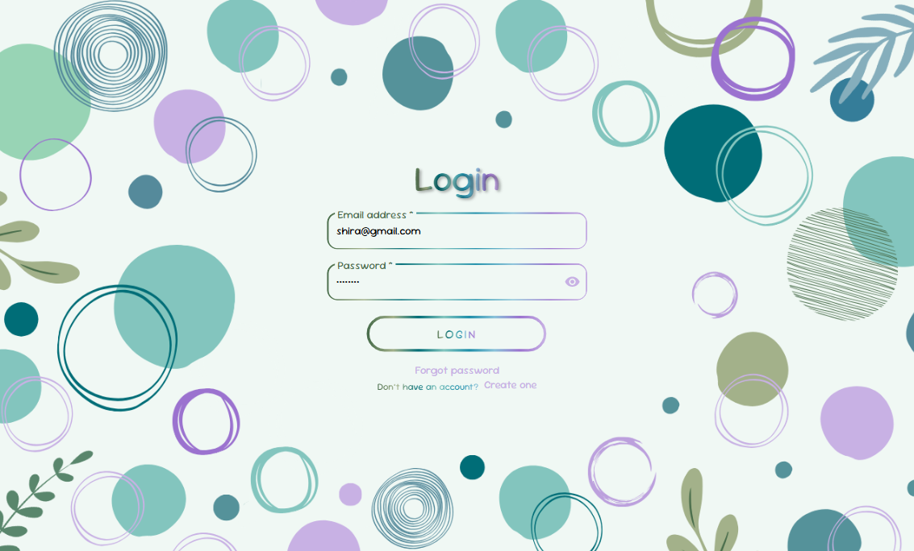

### 3. Register Page

- New users can create an account by providing the required details.
- Upon successful registration, they are redirected to the login page.

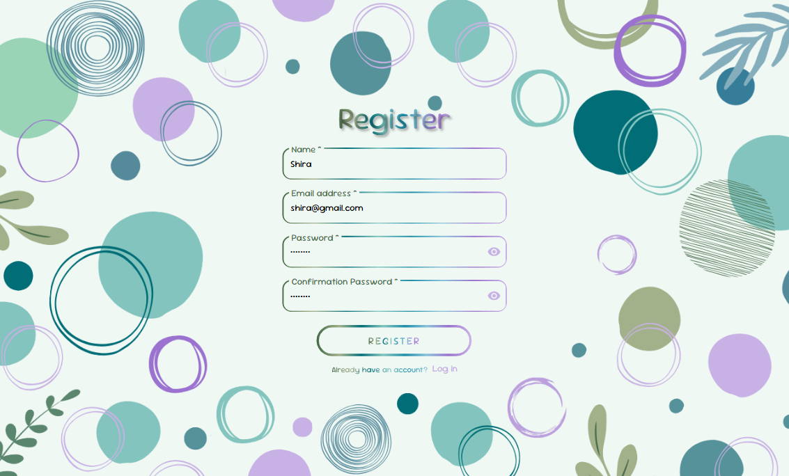

### 4. Password Reset Page

- Users can enter their registered email to receive a verification code.
- After entering the correct code, they can reset their password.
- Upon completing the process, users are redirected to the Login Page, where they can log in with their new password.

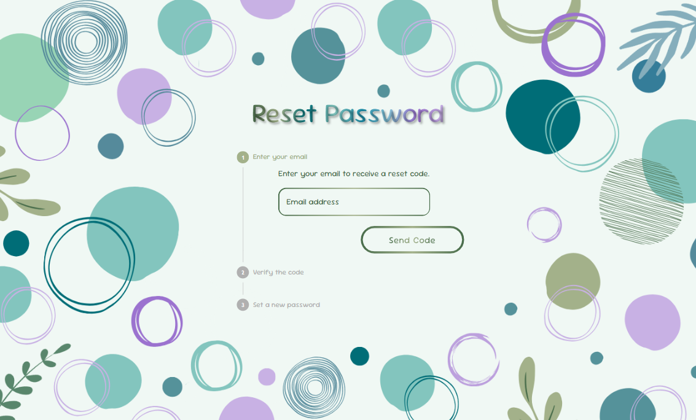

### 5. Dashboard

- Displays a calendar with the user's created events.
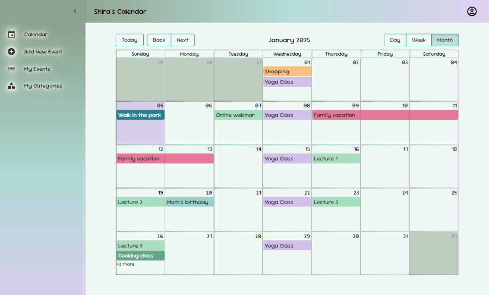

  - Clicking on a day allows the user to easily create an event for that specific day.
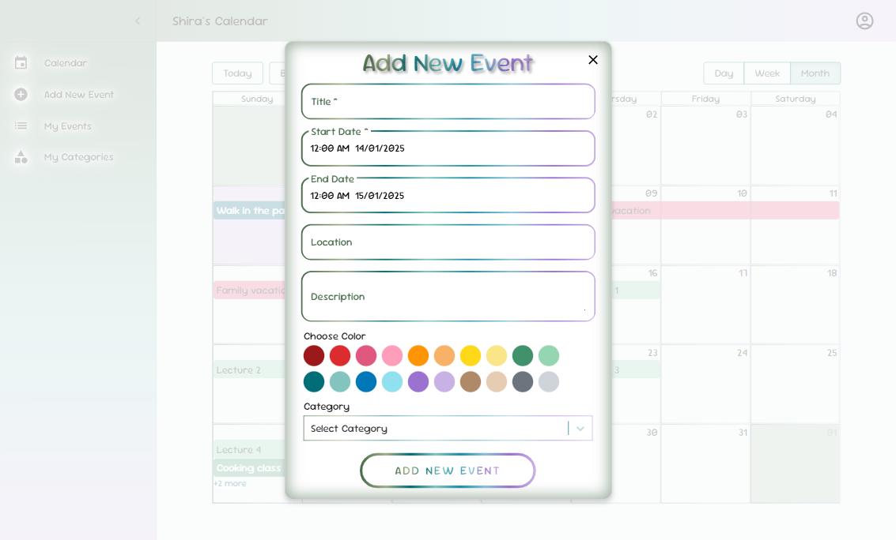

  - Clicking on an existing event opens a detailed view with options to edit or delete the event.
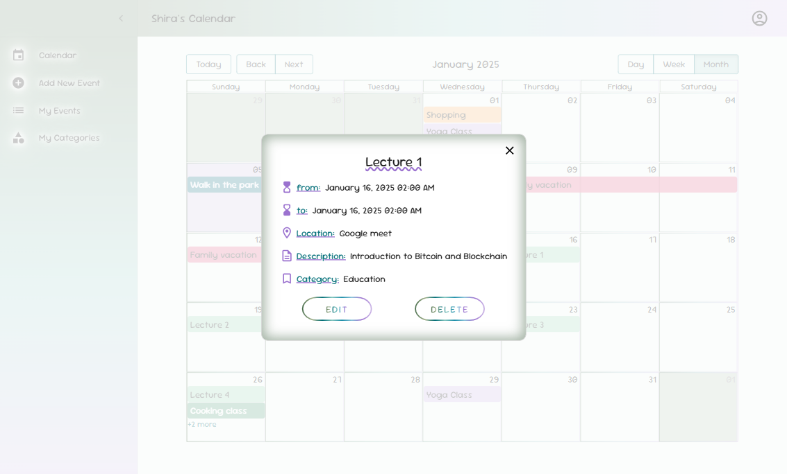


- Sidebar menu options include:
  - **Add New Event**: Create an event by manually entering dates and other details.

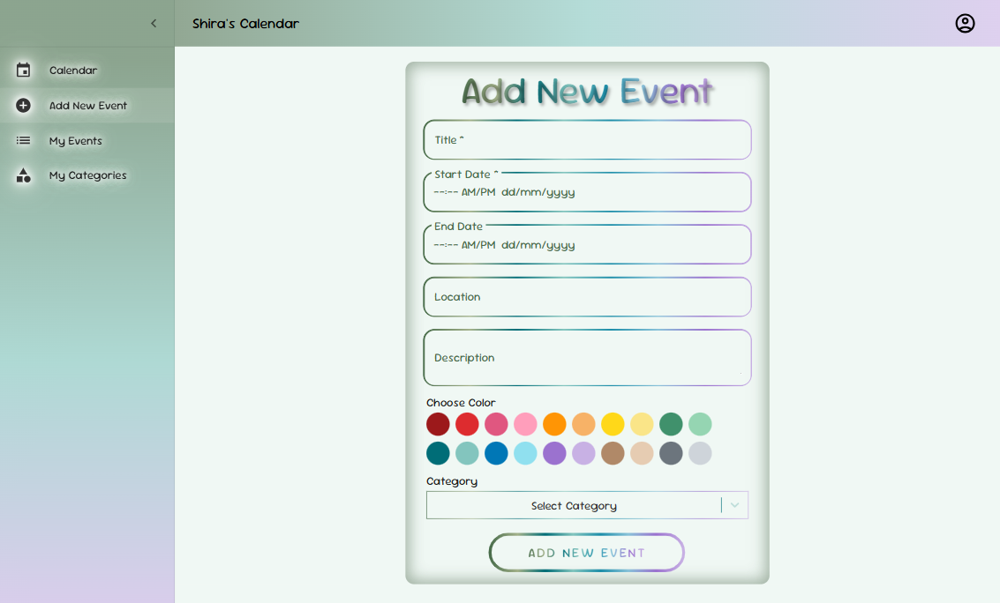

- **Event List**: View all events in a sortable table by columns such as start date, end date, name, category, status (past/today/future), location, and description.

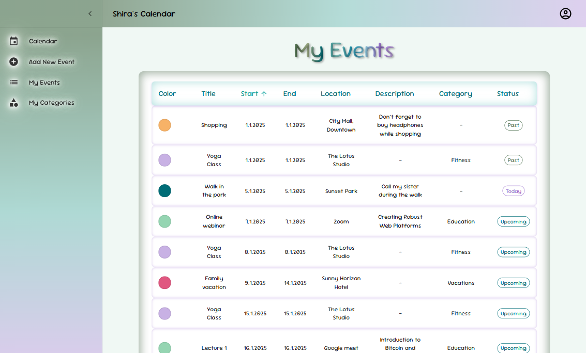

- **Categories**:
  - Add a new category.
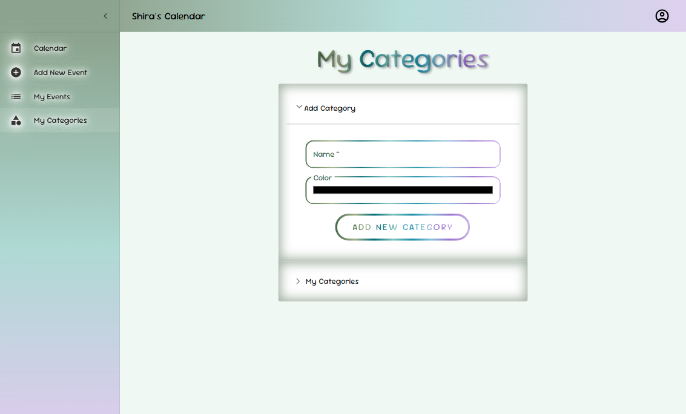

  - View existing categories with options to edit or delete them.
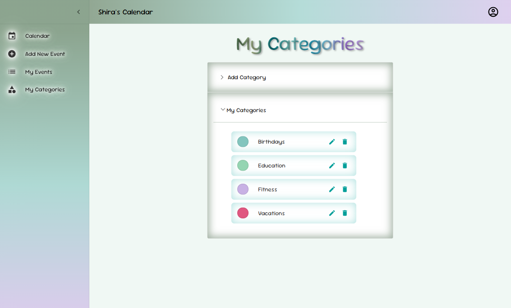

### Profile Menu

- Clicking the profile icon opens the Profile Menu.

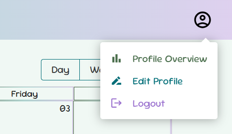

Profile menu options:

- **Profile Overview**: Displays account statistics such as total events created, number of categories, and event breakdown by status (past/today/future).

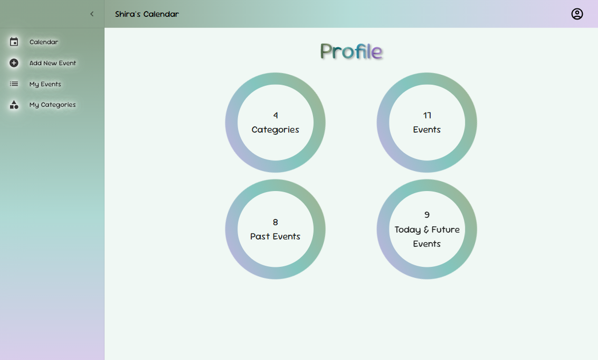

- **Edit Profile**:
  - Update account details such as name, email, or password.

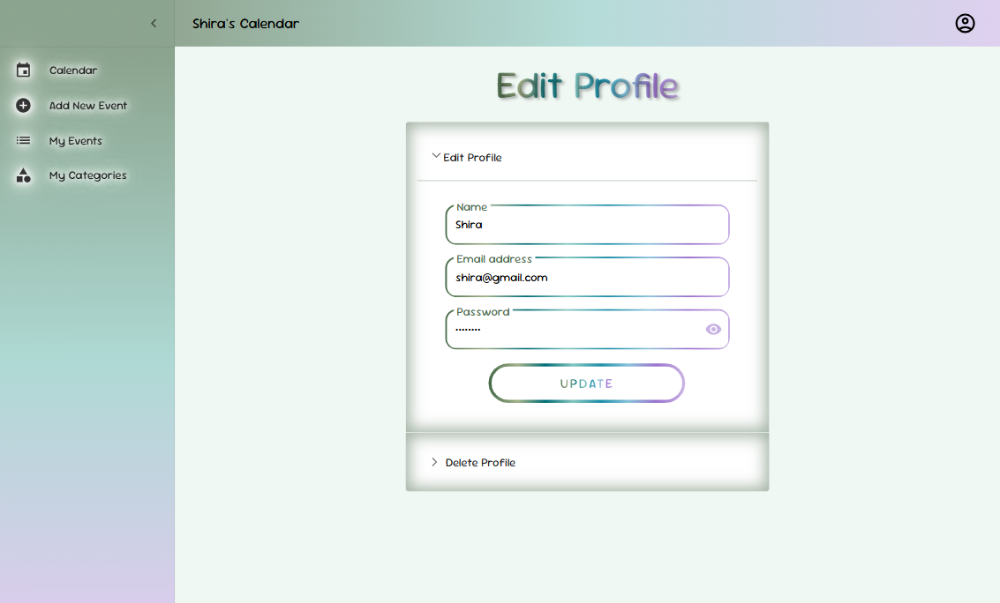

    - Permanently delete the account.

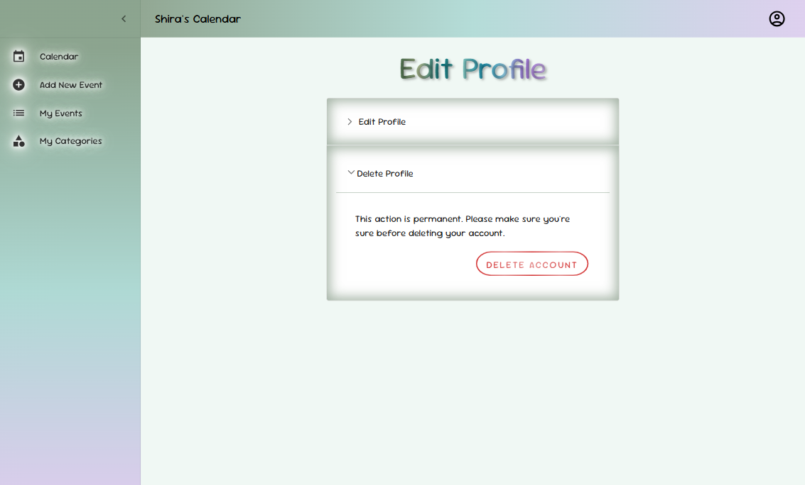

- **Logout**: Securely logs the user out of the current device.

## Directory Structure

**`Back/`** directory:

- **`models/`**: Contains the MongoDB schemas that define the data structure for users, events, and categories.
- **`routes/`**: Defines the API endpoints for the application, grouping related endpoints together by functionality.
- **`controllers/`**: Handles API request logic, including retrieving, creating, updating, and deleting data.
- **`middleware/`**: Includes middleware functions for added security, such as authentication and validation.
- **`db.js`**: Handles the connection to the MongoDB database.
- **`index.js`**: The main entry point that sets up the Express server, initializes the database connection via `db.js`, and defines the application's routes.

**`Front/src/`** directory:

- **`assets/style/`**: Contains CSS files for styling.
- **`pages/`**: Contains the main pages of the website.
  - **`components/`**: A subdirectory within pages for reusable React components used throughout the application.
- **`App.jsx`**: The main application file that sets up routing and overall structure.
- **`main.jsx`**: The entry point of the React application.

## Technologies Used

The project leverages modern web development technologies to deliver a robust and efficient application. Here's a breakdown:

### Backend

- **Node.js**: Provides the server-side runtime environment to handle requests and perform business logic.
- **Express.js**: Simplifies server-side routing and middleware management.
- **JavaScript**: Core language for implementing the backend logic.
- **Axios**: For making HTTP requests, particularly for interacting with the frontend.

### Frontend

- **React**: Used for building a dynamic and interactive user interface.
- **Vite**: A fast development server and build tool to enhance frontend performance.
- **CSS**: Styling the application for a visually appealing and user-friendly design.
- **Material-UI (MUI)**: A React-based UI library for pre-designed, customizable components.
- **React Calendar**: Integrated for rendering and managing calendar views and interactions.

### Database

- **MongoDB**: A NoSQL database to store user data, events, and categories.

## Setup and Installation

### Backend Setup

1. Navigate to the backend directory:

   ```bash
   cd BACK
   ```

2. Install dependencies:

   ```bash
   npm install
   ```

3. Start the server:

   ```bash
   npm start
   ```

### Frontend Setup

1. Navigate to the frontend directory:

   ```bash
   cd FRONT
   ```

2. Install dependencies:

   ```bash
   pnpm install
   ```

3. Start the development server:

   ```bash
   npm run dev
   ```

**Note**: This project uses `pnpm` as the package manager and includes a `pnpm-lock.yaml` file for consistent dependency resolution. It is recommended to use `pnpm` for installing dependencies to ensure compatibility. However, if `pnpm` is not available, you can also install the dependencies with `npm` by running:

   ```bash
   npm install
   ```

## Environment Variables

To ensure the application functions correctly, create `.env` files in both the frontend and backend directories with the following keys:

### Backend `.env`

- `PORT`: The port number the server will run on.
- `DB_URI`: The connection string for the MongoDB database.
- `JWT_SECRET`: Secret key for generating and verifying JSON Web Tokens.
- `EMAIL_USER`: The email address used for sending verification codes.
- `EMAIL_PASSWORD`: The password or app-specific password for the email account.
- `NODE_ENV`: Set to `development` for development mode (http) and `production` for production mode (https).
- `HTTP_ONLY`: Set to `true` for development mode (http) and `false` for production mode (https).

### Frontend `.env`

- `VITE_PORT`: The URL of the backend server (e.g., `http://localhost:3000`).
